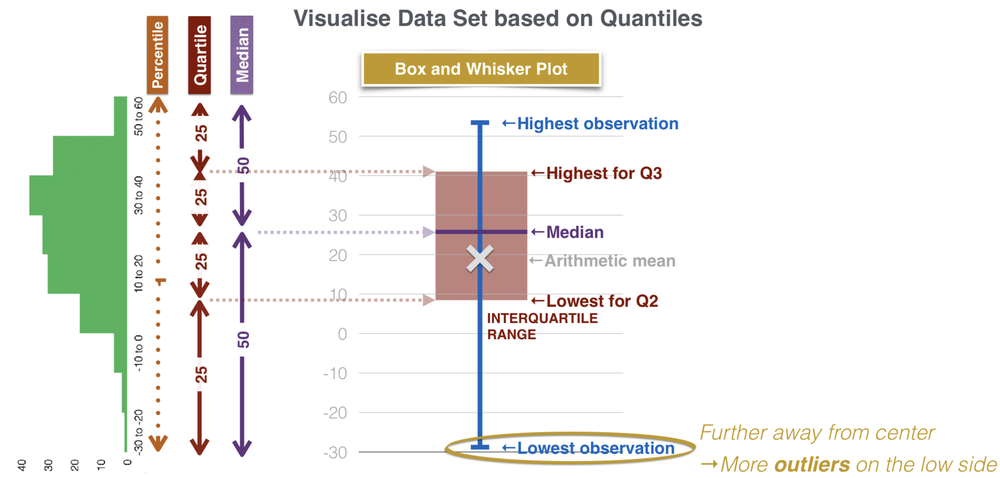

[TOC]

# Reading 1: The Time Value of Money

## Interest Rate

### 1. How an Interest Rate is determined

**Risk Premium:**

* Default risk premium -- Can he pay me back?
* Liquidity risk premium -- How easy is it to convert to cash?
* Maturity risk premium -- How long does he take to pay me back?

**Nominal Risk-free Rate:** (min return an investor expects for any investment)

* Inflation Premium -- How much inflation is expected over this period
* Real risk-free rate -- Single-period interest rate for a risk-free security when there is no inflation

**Required Interest Rate on a security = Nominal Risk-free Rate + Risk Premium**

### 2. Interpretation of Interest Rate

**Key factors when interpreting interest rate:**

(can be same or slightly different depending on context)

1. **Required Rate of Return**

   Required rate of return is the minimum rate of return an investor would wish to earn to postpone current consumption.

2. **Opportunity Cost** *(note that it might be slightly different than interest rate)*

   Opportunity cost is a key factor in interpreting interest rates. It refers to the interest foregone when investors opt for an alternate option, such as spending on current consumption instead of saving or investing

3. **Discount Rate**

   The discount rate refers to the interest rate used to discount future cash flows to reach the present value.

---

## FV of a single Cash Flow

**Future Value of a single cash flow**
$$
FV = PV(1+r)^{N}
$$

$FV$ = Future Value

$PV$ = Present Value

$r$ = periodic interest rate

$N$ = number of periods

$(1+r)^{N}$ = Future Value Factor

<mark>*Make sure the $r$ and $N$ corresponds to the same time period.</mark> The default of "interest rate" often refers to annual interest rate.* 

"p.a" = per annum  ===>  "4.95% p.a" = an annual interest rate of 4.95%

Also, be careful when asked "total interest earned" or "how much total interest can someone expect to earn":

**Total Interest Earned** = $FV - PV$

---

## Effective Annual Rate (EAR) / Effective Annual Yield (EAY)

**Effective Annual Rate (EAR)** -- how much interest is effectively being paid in a whole year
$$
EAR = (1+r)^{N} - 1
$$
$EAR$  allows us to <mark>compare interests that are compounded at different frequencies on an even platform.</mark>

*E.g. It can be used to compare which bank has a better deal (they might have different p.a and different pay periods).* 

---

## Continuous Compounding

**Continuous Compounding** -- The compound frequency becomes infinite
$$
EAR_{cont} = e^{r}-1 \\
$$

$$
FV_{cont} = PV \times e^{rN}
$$

---

## Calculate PV of a single cash flow

 **PV of a single cash flow**
$$
PV = \frac{FV}{(1+r)^{N}}
$$
<mark>*Make sure the $r$ and $N$ corresponds to the same time period.*</mark>  *The default of "interest rate" often refers to annual interest rate.* 

---

## Series of Cashflows

Be sure to master the **TVM function** on the calculator.

Note that the calculator by default assume PMT cashflows are made at **END** of period! To check, simply press `2ND` `BGN`

If the PMT cashflows are at **BEGINNING** of period, press `2ND` `BGN`   `2ND` `SET` to switch.

However, the TVM function on calculator can only be applied <mark>when PMT is the same per period</mark>. If PMT amount is not the same, we have to apply each cashflow as a single cashflow on its own, and sum them up at the end.

---

## Annuities

Use TVM funtion on calculators for solving Annuities problems.

#### 1. Ordinary Annuities

Cashflows occur at the END of each time period.

#### 2. Annuity Due

Cashflows occur at the BEGINNING of each time period.

#### 3. Perpetuities

Perpetuities are like ordinary annuities that cashflows occur at the END of each time period, but cashflows are never-ending. (An ordinary annuity that pays forever)

**For Perpetuities:**
$$
PV_{perp} =\frac{PMT}{r}
$$

# Reading 2: Organizing, Visualizing, and Describing Data

## Organizing Data

### 1. Numerical vs Categorical Data

**Numerical Data**: values that can be counted or measured

* dicrete
* continuous
  * E.g. "Fund A outperforms Fund B by 4%" (measurable)

**Categorical Data** ("Qualitative Data"): labels used to classify a set of data into groups

* Nominal -- labels have no logical order
* Ordinal -- can be ranked in a logical order
  * E.g. "Find A performed better than Find B" (can find relative position but the difference is not measurable)

*A distinguisher of Numerical Data vs Categorical Data: We can only perform mathematical operations only on Numerical Data.*

### 2. Cross-sectional vs Time Series Data

**Cross-sectional Data:** comparable observations all taken at specific time

**Time Series Data:** set of observations taken periodically over a period of time

* Time Series Data is considered a 1D array as it only represents a single variable 
  * E.g. annual sales for Company A from 2015-2020
  * Used to identify trends, cycles, patterns; Forecasting

**Panel Data:** Cross-sectional Data and Time Series Data can be combined to form "**Panel Data**" -- organized as a 2D Array / Data Table.

* Used to compare trends of the same measure across different entities

### 3. Structured vs Unstructured Data

Structured Data: organized in a defined way

* e.g. Market data, earnings forecasts, accounting values

**Unstructured Data**: information in a form with no defined structure

* e.g. Social Media Posts, Corporate Filings, Traffic Data

## Summarizing and Visualizing Data

### 1. Population vs Samples

**Population**: set of ALL possible members of a group of interest

**Samples**: a subset of the population

Parameter - measure used to describe a characteristic of the population

* e.g. mean, standard deviation

Descriptive Statistics: consolidate a mass of data into useful information

Inferential Statistics: make estimates about the population from a sample (based on probability theories)

### 2. Summarizing Data

#### Steps to create a Freqency Distribution:

**Step 1: Define the Intervals**

* Find the min and max of the data
* Considerations for number of intervals: 
  * must cover all observations
  * not too many or too few (~5 to 10 intervals)

**Step 2: Tally and Count the Observations**

* Tally: Assign each observation to their approprate interval
* Count: count the number of observations in each interval

---

This sort of frequency distribution is also known as the **Histogram**

Another way to present the data is to draw a **Frequency Polygon**

**Absolute Frequency**: The actual count of the number of observations within each interval

**Relative Frequency**: Absolute Frequency / Total Observations  x 100%

**Cumulative Relative Frequency**: Build upon Relative Freqency. Sum the freqencies starting at the lowest and progressing through to the highest.

* Cumulative Relative Frequency Distribution
  * Taking the cumulative freqency at each interval and adding it to the next. We accumulate until the last interval is at 100% of the observations.

### 3. Visualizing Data

#### For One Variables:

1. **Histogram**

2. **Bar Chart**

* Usually used to illustrate relative differences in sizes, degrees, or magnitude across categories/entities
* **Stacked/Grouped Bar Chart**: used when there are more than 1 category of data
  * Stacked Bar Chart: e.g. compare total Sales (breakdown is additional information)
  * Grouped Bar Chart: compare individual categories across entity
* All bar charts can be displayed vertically or horizontally (line charts are normally displayed horizontally)

3. **Line Chart**

* for visualization of time series data
* Bubble Line Chart (additional dimention to line chart)
* Dual-scale Line Chart (additional dimention to line chart)
  * e.g. one line to represents Sales (\$) over time, another to represents Net Profit Margin (%) over time
  * each line has its own scale clearly marked on each side (two different y-axis)

#### For more than one variables:

4. **Contingency Table**: allow us to analyze two variables at the same time

* variables in the contingency table must be categorical (finite number of categories)

* each cell -- freqency with which we observe two attributes simultaneously (this is called *"Joint Freqency"*

* Total freqency for a row or column is called *"Marginal Freqency"*

* Note that a contingency table can be expressed in terms of Absolute Frequencies or Relative Frequencies

  * If it is expressed with Relative Freqencies, the sum of all observations must equal 100%

* One application of the contingency table is to determine whether two variables are independent

  * e.g. industry vs market cap
  * the chi-square test of independence is covered under Hypothesis Testing

* One way to visualize a contingency table is to use a **Heat Map**

  * Color and shade reflect freqency

* Another way to visualize a contingency table is to use a **Tree Map**

  * Size of block reflect freqency
  * Steps to create a Tree Map:
    * first draw a block to reflect the total number of observations
    * then segregate this block based on the one of the attributes/variables (e.g. first segregate based on *Industry* where each industry has its own primary color)
    * next segregate based on the other attribute (e.g. then segregate based on market cap. Darker colors are used to represent large-cap stocks)

* One special kind of contingency table is a 2 x 2 array called "**Confusion Matrix**"

  * used to evaluate performance of a calssification model

  * e.g. an analyst created a model to predict if a company will default

    * if actual data = yes, model prediction = no: false negative

    * if actual data = no, model prediction = yes: false positive

      

5. **Word Cloud**: when analyzing large amount of text

* Larger the text, the higher the frequency
* Can be used to analyze the predominant sentiment of a general population

6. **Scatter Plot**: visualze relationship between **2** variables

* e.g. It is reasonable to expect the return of a particular stock is related to the market index such as the S&P500
* Each point on the scatter plot shows the values of both variables at a point in time.
* From scatter plot, we can see if there is (postive/negative) linear relationship between 2 variables
* **Matrix Scatter Plot:** analyze relationship between 3 or more variables
  * to analyze 3 variables at the same time
    * we can create a 3 x 3 matrix that consists pair-wise scatter plots of these variables, each scatter plot presenting 2 of the 3 variables

#### Flow Chart for Selecting the Right Visualization Types

TBA.

## Measures of Central Tendency

### 1. Mean

(Pay attention to the different symbol conventions used to denote different types of means, see below.)

Population Mean: $\mu = \frac{\Sigma X}{N}$

Sample Mean: $\bar{X} = \frac{\Sigma X}{n}$

They are both examples of **Arithmetic Mean** -- that is the sum of observation values / numbers of observations

* For Arithmetic mean, the sum of Deviations:  $\sum_{i = 1}^{n}(X_{i}-\bar{X})  = 0$
* The intrinsic assumption is that each observation has equal weight

**Weighted Mean**: Multiply each of the observations by their corresponding weight and sum them up.

### 2. Mode

**Mode**: Most freqently occurring observation in the series

* If there is only 1 observation for each value in a series, then there is no mode
* Mode is not useful for small data sets or continuous data; but useful for identifying the most prevalant observation for large sample sizes
* When an distribution:
  * has one value that appears most freqently, it is said to be *"Unimodal"*
  * has two modes, it is said to be *"Bimodal"*
  * has three modes, it is *"Trimodal"*

### 3. Median

**Median**: Middle element in an ordered series.

* If even number of elements, sum up the 2 middle elements and divide by 2.
* The advantage of using Median over Mean:
  * not skewed by outliers

### 4. Harmonic mean

**Harmonic Mean** =
$$
\frac{N}{\sum_{i=1}^{N}\frac{1}{X_{i}} }
$$

* The most common application of Harmonic Mean in Finance is 
  * in calculating the average cost of shares purchased over a period of time (the average price paid per unit)
  * The benefit of regular investments into mutual funds -- Dollar cost averaging

### 5. Geometric Mean

Geometric Mean = 
$$
(X_{1}\times X_{2}\times...\times X_{n} )^{1/n}
$$

* In Finance, Geometric Means are often used to calculate mean return or growth over multiple periods 

  * When calculating the Geometric Mean $R_{G}$ for returns data sets, it is necessary to add 1 to each return value
    $$
    1+R_{G} = [(1+R_{1})\times (1+R_{2})\times...\times (1+R_{n})]^{1/n}
    $$
    Then we can use this equation to get $R_{G}$:
    $$
    R_{G} =[(1+R_{1})\times (1+R_{2})\times...\times (1+R_{n})]^{1/n} - 1
    $$
    $R_{G}$ is known as *the time weighted rate of return*.

---

### Summary:

#### Identify the most appropriate measure to use

So far, we have learned 5 measures of central tendency: **Weighted Mean**, **Mode**, **Median**, **Harmonic Mean**, and **Geometric Mean**. One of the most important learnings is to determine the most appropriate measure for each of them and use it to solve each problem.

*Exercise: Identify the most appropriate measure for the following scenarios:*

1. John bought into a mutual fund when the price per unit was \$4.10, \$4.60, and \$4.75. He placed \$2000 each time. What is the average price paid per unit?

**Harmonic Mean.**

Harmonic Mean is ideal for finding the average price per unit in dollar-cost averaging applications like this. Apply the figure into the formula:
$$
\frac{N}{\sum_{i=1}^{N}\frac{1}{X_{i}} } = \frac{3}{1/4.10 +1/4.60+1/4.75 }=\$4.47
$$
Note that we **do not need to know the timing of each of these purchases** as in this case. All that is needed is for **the amount invested each time to be the same** (which, in this case, is \$2000).

2. **Mode** is the *only* measure among central tendency that can be used with nominal data.

3. The holding period returns of a stock are -8%, -17%, 102%, 7%, 19%, 7% and -1% for the past 7 years. What is the measure to use if we do not wish to have outlier figures skew the measurement?

**Median**.

4. The holding period returns of a fund for the past 3 years are 10%, -6% and -9%. Determine an appropriate annualized rate of return for the past 3 years.

**Geometric Mean**.

Geometric Mean is commonly used to compute the growth rate of a variable.

Given the holding period returns, we multiply their growth factors and find the thir root of it. Remember to minus one at the end in order to extract the growth rate.
$$
R_{G}=[(1+0.1)\times(1-0.06)\times(1-0.09)]^{1/3}-1=0.98-1=-2.0\%
$$
So here we find that the account actually fell an annualized 2.0 percent per year. You may recall this is exactly the method we used to find the time weighted rate of return (TWRR) of a portfolio.

5. **Weighted Mean** is often used to calculate portfolio returns when the allocation of assets are not even.

#### Geometric Mean vs Arithmetic Mean

* Geometric Mean is mathematically correct calculation of past returns.

* Arithmetic Mean is a better estimator of future returns.

					

---

### 6. Quantiles

**Examples of Quantiles:**

* Quartile -- dividing the data set into quarters (25% or 1/4)
* Quintile -- dividing the data set into 5 parts (20% or 1/5)
* Decile -- dividing the data set into tenths (10% or 1/10)
* Percentile -- dividing into hundredths (1% or 1/100)

Note that any quantile can be expressed as a percentile. Examples:

* 3rd Quartile = 75th Percentile
* 2nd Quintile = 40th Percentile
* 8th Decile = 80th Percentile

Interquartile Range: The difference between the third quartile and the first quartile (25%-75%)

#### Calculate the value at a quantile for a given distribution of return

Step 1: Sort the data in ascending order

Step 2: Convert the quantile to percentile $y$

Step 3: Use the following formula to find out the position of the observation at a given percentile $y$, with $n$ data points sorted in Step 1
$$
L_{y} =(n+1)\times\frac{y}{100}
$$
Remember to *"plus 1"* in the formula. 

Step 4: Find the value at $L_{y}$ in the distribution. 

*To understand why it is $(n+1)$, here are some useful resources:*

* https://www.quora.com/Why-is-there-a-plus-1-in-the-formula-of-quartile-decile-and-percentile

**E.g.** The following are the returns of the 10 stocks listed in Wonderland stock market for the past year. What is the 3rd quartile of the return?

-12%, -12%, -5%, 0%, 1%, 1%, 8%, 13%, 19%, 54%

Solution:

* Note that the data is already in ascending order.

* 3rd quartile = 75th percentile

* Use the formula to find the position/location of the value at 75th percentile:
  $$
  L_{y} =(n+1)\times\frac{y}{100} = (10+1)\times\frac{75}{100}=8.25
  $$
  From the data, we know that the 8th value = $13\%$ and the 9th value = $19\%$

  Therefore, the value at 75th percentile is:
  $$
  13\% + (19\%-13\%)\times0.25=14.5\%
  $$
  This means that 75% of the all observations were below $14.5\%$.

#### Visualize a Data Set based on Quantiles

To visualize a data set based on quantiles, we can create a box and whisker plot.

#### Techniques to exclude outliers from a measure of central tendency

1. Trimmed Mean: discard a stated percentage of the most extreme observation

   Example: a 10%-trimmed mean will discard the lowest 5% observations and the highest 5% observations

   * Only the middle 90% of the observations are considered in the calculation of the mean

2. Winsorized Mean: substitute a value for a started percentage of the most extreme observations

   Example: to calculate 90%-winsorized mean, we will determine the 5th and 95th percentile of the observations. Any values lower than the 5th percentile will be substituted with 5th percentile value and any values greater than the 95th percentile will be substitute with the 95th percentile value

   * All the observations are considered in the calculation of the mean, just that the extreme outliers are substituted with values that are not too extreme.

## Measures of Dispersion

### 1. Range and MAD

**Range** = maximum value - minimum value

**Mean Absolute Deviation (MAD)**: sum up the deviation of every observation from the mean and find their average (note that for observations below the mean, since their deviation will be negative values, we get the absolute deviation)
$$
MAD = \frac{\Sigma |X-\bar{X}|}{N}
$$
MAD can describe the distribution better than just the range.

### 2. Variance and Standard Deviation

Instead of taking the absolute Deviation, the more widely used approach is to take the average of the square of the deviations. This is known as **Variance**, denoted by $\sigma^{2} $.

#### Population Variance:

$$
\sigma^{2} =\frac{\Sigma (X-\mu )^2}{N}
$$

And therefore, we get the **Population Standard Deviation** $\sigma$:
$$
\sigma =\sqrt{\frac{\Sigma (X-\mu )^2}{N}}
$$
Note that standard deviation $\sigma\geq MAD$, as $\sigma$ Gives more weight to larger deviations. 

Caution:

Also note that the above formula apply to populations where we need to consider every memeber of the population. But often times, the population is too big or we don't have all the data. Therefore, what we use more often are **sample variance**, denoted as $s^2$, and **sample deviation**, denoted as $s$.

#### Sample Variance

$$
s^{2} =\frac{\Sigma (X-\bar{X} )^2}{n-1}
$$

#### Sample Standard Deviation

$$
s =\sqrt{\frac{\Sigma (X-\bar{X} )^2}{n-1}}
$$

Note that to calculate Sample Variance $s^2$ and Sample Standard Deviation $s$, we use $n-1$ and not $n$. This allows us to get unbiased estimate of the actual population parameter. Do note that the mean here is the sample mean, denoted by $\bar{X}$ instead of $\mu$.

**Steps to calculate sample standard deviation**

Step 1: Calculate sample mean $\bar{X}$

Step 2: Calculate deviation of each sample observation from the $\bar{X}$

$(X_{1}-\bar{X}),(X_{2}-\bar{X}),...,(X_{n}-\bar{X})$

Step 3: Square every deviation

$(X_{1}-\bar{X})^2,(X_{2}-\bar{X})^2,...,(X_{n}-\bar{X})^2$

Step 4: Sum every squared deviation

$(X_{1}-\bar{X})^2+(X_{2}-\bar{X})^2+...+(X_{n}-\bar{X})^2 =\Sigma (X-\bar{X} )^2$

Step 5: Divide by number of sample minus 1, $(n-1)$, and get the sample variance
$$
s^{2} =\frac{\Sigma (X-\bar{X} )^2}{n-1}
$$
Step 6: Apply square root to get the standard deviation
$$
s =\sqrt{\frac{\Sigma (X-\bar{X} )^2}{n-1}}
$$

#### Standard Deviation in Finance

In Fiance, Std Dev is often seen as a measure of risk.

However, one shortcoming of using standard deviation is: a measure of risk is that both the positive deviation and negative deviation are considered. And if you are an investor, you probably would not consider the positive deviation as risk since you will be happy that the fund performs better. You'd only be concerned about the downside risk.

### 3. Downside Deviation

One measure of downside risk is **target downside deviation**, which is also know as **target semideviation**.

#### Calculate downside deviation

Calculating downside deviation is similar to calculate standard deviation.

* Just that instead of the mean, we choose a target against which to measure each outcome. This target can be any meaningful figure to benchmark against.

$$
s =\sqrt{\frac{\Sigma (X-B)^2}{n-1}}
$$

e.g. If a fund manager claims that the fund has an expected return of 5%, we can set this as the target $B$.

*  The other important difference is that we only include negative deviations from the target in calculation, and that is when $X_{i}-B < 0$
* Also note that the denominator remains the sample size $n$ minus 1, and that is $(n-1)$, even though we are not using all the observations in the numerator.

Example question can be:

*The past 5 yeaers return for a mutual fund is given below. Calculate the target downside deviation with 5% as the target.*

### 4. Coefficient of Variation & Sharpe Ratio

#### Calculate CV

One application of standard deviation is to calculate the **coefficient of variation (CV)**. This is to address the issue of relative degree of variability of different data sets -- A direct comparison between the dispersion of two distributions is not meaningful because of the relatively large difference in their means.

**Coefficient of Variation**:
$$
CV = \frac{\textrm{Std Dev}}{\textrm{Mean}}
$$
In an investments setting and in evaluating returns, deviation is associated with risk, and the mean is the expected return. So $CV$ can be a measure of the risk per unit of return. A lower $CV$ is better. 

#### Sharpe Ratio

The Sharpe Ratio is the inverse of the coefficient of variation -- it measures the return per unit of risk. 

* By definition, the Sharpe Ratio is the *excess return* per unit of risk. So we have to subtract the risk-free rate to find the *excess return*. 
  * Resource to understand Sharpe Ratio: https://www.investopedia.com/terms/s/sharperatio.asp

$$
\textrm{Sharpe Ratio} = \frac{\textrm{Excess Return}}{\textrm{Std Dev}}=\frac{r_{p}-r_{f}}{\sigma_{p}}
$$

*Where:*

$r_{p} = \textrm{return of portfolio}$

$r_{f} = \textrm{risk-free rate}$

$\sigma_{p} = \textrm{standard deviation of the portfolio's excess return}$

* In evaluating investment options, more returns and less risk is desirable. So you'd want to choose those with higher Sharpe Ratio.

Example:

You are presented with the mean and standard deviation of the monthly returns of T-bills and the S&P 500 for the past 10 years. Calculate the COV and Sharpe ratio for both of them. (You may use the T-bill rate to represent the risk-free rate.)

|             | T-Bills | S&P 500 |
| :---------: | :-----: | :-----: |
|  **Mean**   |  0.25%  |  1.22%  |
| **Std Dev** |  0.33%  |  6.81%  |

Solution:

**T-Bills:**

COV = 0.33 / 0.25 = 1.32.         -- Less relative risk

Sharpe ratio = (0.25-0.25) / 0.33 = 0

**S&P 500**:

COV = 6.81 / 1.22 = 5.58

Sharpe ratio = (1.22 - 0.25) / 6.81 = 0.14.         --Higer risk-adjusted returns

Notes: 

* Note that the returns of the T-bills are used as the risk-free rate. This is often the case. If in the exam, you are not given a risk-free rae, but the T-bills rate of return is know, you may use the T-bill rate as a proxy for the risk-free rate.
* the Sharpe ratio can be negative if the average return of the asset is lower than the risk-free rate
